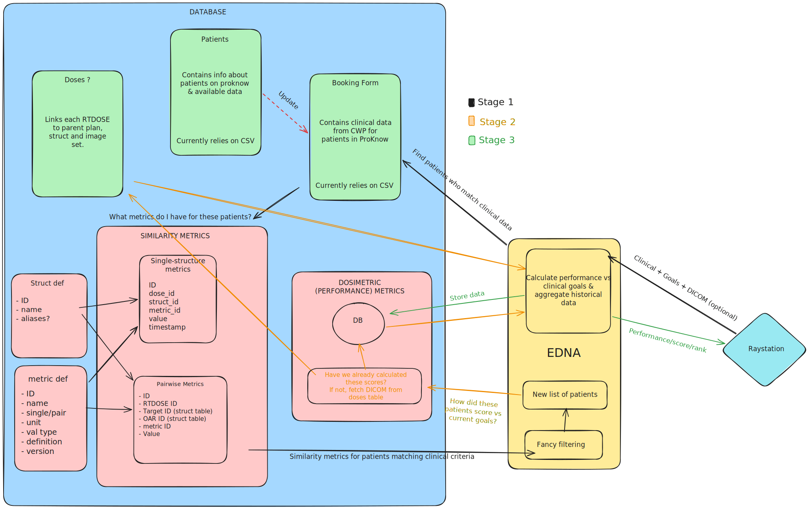

## Harvest Proknow
[](https://github.com/Christie-Scientific-Computing/HarvestProKnow/actions/workflows/tests.yml)
Queries Proknow, collects data and writes to the BigDB (psql@192.168.117:32899). This script should be run fairly regularly to make sure the DB stays up-to-date.

Used alongside EDNA as part of the Continuous Improvement platform.

For each patient ID, the harvester pulls from Proknow:
- Patient demographics/summary (`patients` table)
- Treatment/plan info per dose (`doses` table)
- Dose-volume histograms per structure (`dvh_data` table)
- Pairwise target/OAR geometrical metrics — Dice, overlap, surface distances (`geom_metrics` table)

A second data source, `AskCWP` (`api/cwp_client.py`), can pull booking-form data from The Christie's CWP/EForms SQL Server database, but is currently disabled in `harvest.py` — see TODO below.

# Design and link to EDNA


## Setup

Requires:
- A `.env` file at `/config/.secrets/HarvestProknow/.env` providing `PROKNOW_WORKSPACE`, `PROKNOW_CREDS`, `DB_HOST`, `DB_PORT`, `DB_NAME`, `DB_USER`, `DB_PASS` (and `CHRISTIE_CREDS` if CWP is re-enabled).
- [config.toml](config.toml) for non-secret runtime config: path to the patient ID CSV, logging options.
- A running PostgreSQL instance with the `patients`, `doses`, `dvh_data`, and `geom_metrics` tables already created (schema isn't managed by this repo).

## Usage

```bash
pip install -r requirements.txt
python harvest.py
```

# TODO
    - Don't rely on patient IDs. Query ProKnow daily to detect new patients in WORKSPACE.
    - Querying CWP only works on Windows (user authentication).
    - CWP Query only returns latest booking form. Might be conflicts for re-treated patients.
